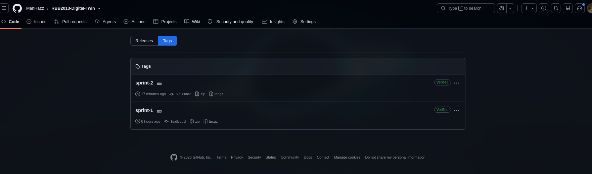
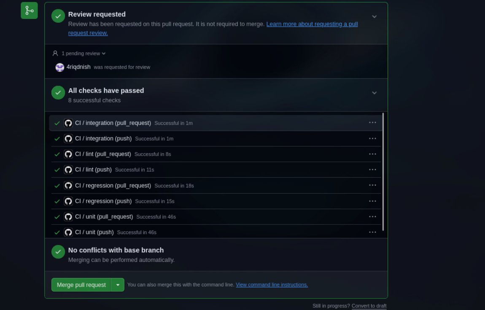

# XLeRobot Digital Twin — Development Practices

**Course:** RBB2013 Digital Twin (May 2026)
**Team:** Aiman (lead), Bento, Ariq, Ibrohim, Raziq
**Rubric:** Project Development Practices (5%)
**Repository:** https://github.com/ManHazz/RBB2013-Digital-Twin

> *"Demonstrate evidence of applying sprint planning and execution (clear features, milestones and deliverables from every team member) over at least 2 sprint cycles and consistent version control of individual and group merge at the end of sprint. Unit and interface / integration tests have to be developed for each module and demonstrated pass and fail cases. Updates are to be triggered by automatic build and application of regression test suite to demonstrate CI/CD principles."*

---

## 1. Two sprint cycles with per-teammate deliverables

Every teammate authored real commits in **both** sprints across every module of the system. Full atomic task list with per-teammate ownership: [`TASK_ALLOCATION.md`](../TASK_ALLOCATION.md). Deliverables and integration bugs caught mid-sprint: [`docs/SPRINT_LOG.md`](./SPRINT_LOG.md). Fixes applied: [`FIXES_SPRINT1.md`](../FIXES_SPRINT1.md).

### Sprint 1 (26–30 Jul 2026) — tag `sprint-1`, PR #2 merged

| Teammate | Module | Deliverables |
|----------|--------|--------------|
| **Aiman** | integration + contracts | Repo scaffold (A-01), frozen pydantic v2 contracts v1.0 (A-02), interface-contracts.md (A-03), sim/extension.py pointer (A-04) |
| **Bento** | nl-command | FastAPI service (Bento-01), Ollama wire-up (Bento-02), unit tests happy + fail (Bento-03/04), contract rows (Bento-05) |
| **Ariq** | motion-planner | Wrap robot_ik in FastAPI (Ariq-01/02), IK round-trip test (Ariq-03), unreachable + colliding fail tests (Ariq-04/05), contract rows (Ariq-06) |
| **Ibrohim** | dispatcher + actuation | Dispatcher scaffold (Ibrohim-01), 30 fps interpolator + ZMQ (Ibrohim-02), unit tests (Ibrohim-03), actuation service (Ibrohim-04), MQTT unit test (Ibrohim-05), contract rows (Ibrohim-06) |
| **Raziq** | telemetry + persistence | TimescaleDB init.sql (Raziq-01), telemetry service (Raziq-02/03), Timescale + Redis unit tests (Raziq-04/05), contract rows (Raziq-06) |

Sprint-1 group merge: `feat/integration` → `main` via PR #2, five teammate branches merged in.

### Sprint 2 (31 Jul 2026) — tag `sprint-2`, PR #3 merged

| Teammate | Module | Deliverables |
|----------|--------|--------------|
| **Aiman** | compose + system test + submission docs | docker-compose.yml + mosquitto (A-06), system test (A-07), 4 rubric artifact notebooks, live-smoke integration hotfixes |
| **Bento** | CI + regression | Integration test nl→planner (Bento-06), CI pipeline (Bento-07), golden IK regression suite (Bento-08) |
| **Ariq** | scaling + integration | Integration test planner→dispatcher (Ariq-07), nginx round-robin + SCALING_PROOF.md (Ariq-08) |
| **Ibrohim** | integration | Integration test actuation→mosquitto with real broker via testcontainers (Ibrohim-07) |
| **Raziq** | integration + Grafana + persistence | Integration test sim→telemetry (Raziq-07), Grafana provisioning + dashboard (Raziq-08), persistence proof (Raziq-09) |

Sprint-2 group merge: PR #3 (post-integration hotfix bundle) merged after all sprint-2 branch work landed. Then tag `sprint-2` on main.

---

## 2. Consistent version control — individual + group merge

- **One feature branch per teammate:** `feat/nl-command`, `feat/motion-planner`, `feat/dispatcher-actuation`, `feat/telemetry-observability`. Aiman on `feat/integration` (integrator role).
- **One task = one commit rule** enforced via `TASK_ALLOCATION.md`. Commits carry the atomic task ID (e.g. `Bento-06:`, `Raziq-08:`) so git history maps 1:1 to the plan.
- **Never push to `main` directly** — all changes flow through PRs into `feat/integration`, then a single group PR into `main` per sprint boundary.
- **Sprint boundaries tagged:** `sprint-1` on the sprint-1 merge commit, `sprint-2` on the sprint-2 merge commit. Tags pushed to origin.
- **Every teammate has authored commits on `main`** — visible in the "5 contributors" indicator on the merged PRs.

**Screenshot — sprint tags:**

**Screenshot — sprint-2 group merge PR (all checks green, 5 contributors):**

---

## 3. Unit + interface/integration tests for each module

Full test topology in [`docs/DEPLOYMENT.ipynb`](./DEPLOYMENT.ipynb) §7.

### 3.1 Unit tests — with pass AND fail cases (rubric explicit)

| Module | Test file | Pass case | Fail case |
|--------|-----------|-----------|-----------|
| nl-command | `tests/unit/test_nl_command.py` | Correct pose returned for valid LLM completion | `test_empty_text_returns_422`, `test_garbled_ollama_returns_422` |
| motion-planner | `tests/unit/test_motion_planner.py` | IK round-trip within 1e-3 | `test_unreachable_target_rejected`, `test_colliding_target_rejected` |
| dispatcher | `tests/unit/test_dispatcher.py` | 30 frames sent, first/last correct | — |
| actuation | `tests/unit/test_actuation.py` | Correct MQTT topic + payload | Wrong joint count → 422 |
| telemetry | `tests/unit/test_telemetry.py` | Timescale insert + Redis SET verified | — |

### 3.2 Integration tests — each service pair, against real infrastructure

| Pair | Test file | Real infra used |
|------|-----------|-----------------|
| nl-command → motion-planner | `tests/integration/test_nl_to_planner.py` | Live TestClient chain, Ollama stubbed |
| motion-planner → dispatcher | `tests/integration/test_planner_to_dispatcher.py` | Live TestClient chain, ZMQ mocked |
| actuation → mosquitto | `tests/integration/test_actuation_mqtt.py` | testcontainers spins real `eclipse-mosquitto:2` |
| sim state → Timescale + Redis | `tests/integration/test_sim_to_telemetry.py` | testcontainers spins real Timescale + Redis |

### 3.3 System test — full stack end-to-end

`tests/system/test_end_to_end.py` — brings up compose stack, POSTs `/command`, asserts a `robot_state` row lands in TimescaleDB within 10 s.

---

## 4. CI/CD — automatic build + regression test suite

`.github/workflows/ci.yml` — runs on every push and pull request. Chain: **lint → unit → integration → regression**.

- **lint** (ruff) — fails on any style/import issue.
- **unit** (pytest tests/unit) — fast, no infra.
- **integration** (pytest tests/integration) — GitHub Actions provisions Timescale, Redis, Mosquitto as service containers; testcontainers spawn per-test containers on top for pair isolation.
- **regression** (pytest tests/regression) — fixed golden IK cases; fails the build if IK math drifts.

**Screenshot — the sprint-2 hotfix PR with all 8 checks green:**

*Every push to any branch triggers this pipeline. Every PR into main must pass all four jobs before merge. This is the automatic build + automatic regression test loop the rubric asks for.*

---

## 5. Version control artifacts (verifiable on GitHub)

- **Sprint tags on main:** [`sprint-1`](https://github.com/ManHazz/RBB2013-Digital-Twin/releases/tag/sprint-1), [`sprint-2`](https://github.com/ManHazz/RBB2013-Digital-Twin/releases/tag/sprint-2)
- **Group merge PRs:** [#2 Sprint 1](https://github.com/ManHazz/RBB2013-Digital-Twin/pull/2), [#3 Sprint 2 hotfix](https://github.com/ManHazz/RBB2013-Digital-Twin/pull/3)
- **CI runs:** https://github.com/ManHazz/RBB2013-Digital-Twin/actions
- **Contributors on merged PRs:** 5 (all teammates authored real commits into main)

---

## 6. Rubric coverage checklist

| Rubric line | Evidence |
|-------------|---------|
| Sprint planning + execution, per-teammate deliverables | §1 (both sprint tables) + [`TASK_ALLOCATION.md`](../TASK_ALLOCATION.md) |
| Over at least 2 sprint cycles | §1 (sprint 1 + sprint 2 both tagged and merged) |
| Consistent version control of individual and group merge | §2 (one-branch-per-teammate + PR-per-sprint + tag) |
| Unit and interface/integration tests for each module | §3 (per-module unit + per-pair integration) |
| Pass AND fail cases demonstrated | §3.1 fail-case column populated for all modules with rejection logic |
| System tests | §3.3 (`tests/system/test_end_to_end.py`) |
| Automatic build + regression test suite | §4 (`.github/workflows/ci.yml` chained lint → unit → integration → regression on every push) |
| For all modules of the system | §1 (every teammate + every module has authored commits in both sprints) |
