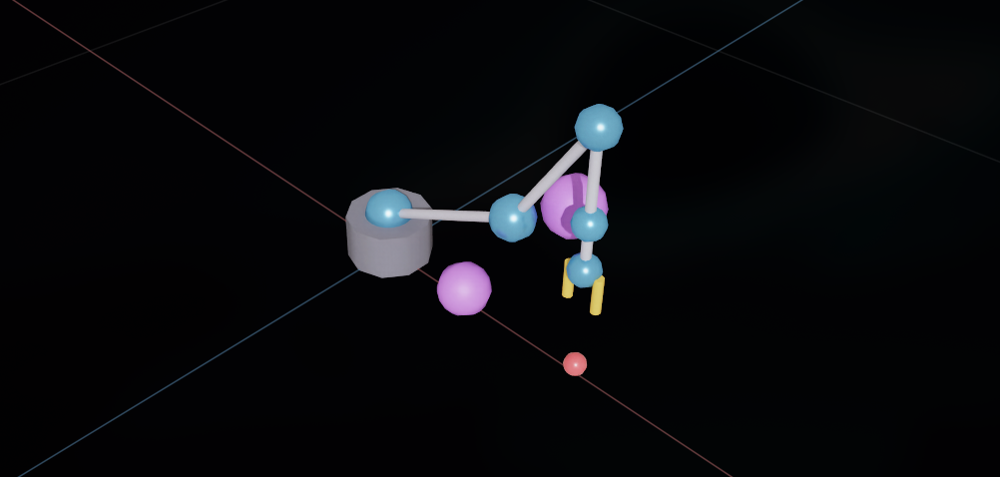
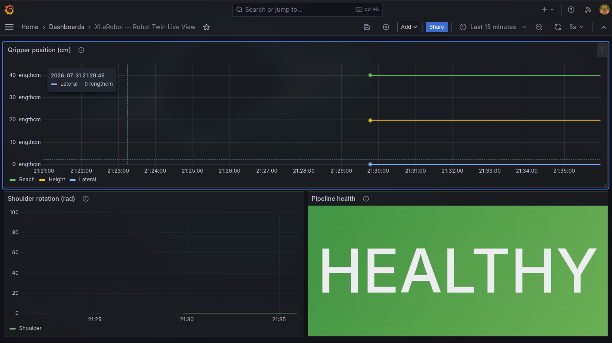
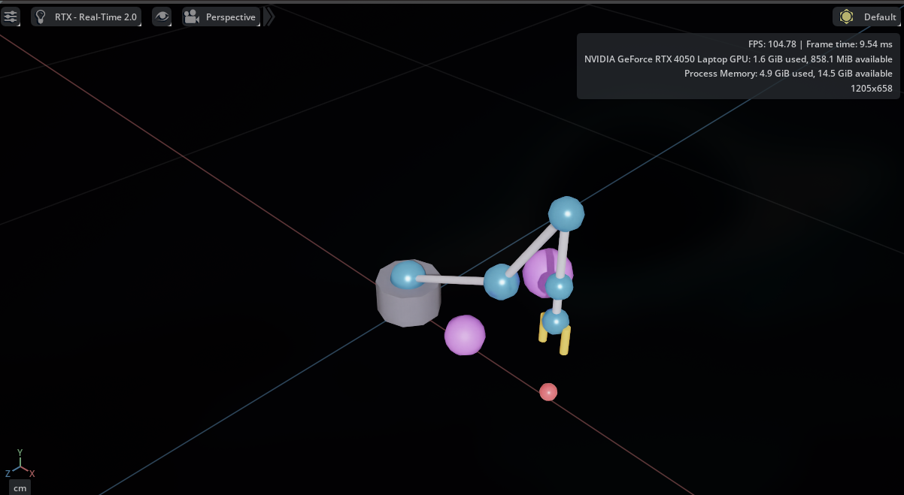

# Visualization — XLeRobot Digital Twin

**Course:** RBB2013 Digital Twin (May 2026)
**Rubric:** Project Visualization (5%)
**Repository:** https://github.com/ManHazz/RBB2013-Digital-Twin

**Team members:**

| Name | Student ID |
|------|------------|
| Muhammad Aiman bin Ahmad Hazimin | 22011708 |
| Hazieq Danial bin Roshihan Annuar | 24006633 |
| Muhammad Raziq bin Sufian | 24006626 |
| Ibrohim bin Ahmad Jaafar Sadzik | 24006396 |
| Ariq Danish bin Nor Razak | 24006796 |

---

## 1. What we visualise and why

The digital twin has two audiences and two questions:

1. **The operator**, who wants to see the robot arm move right now — "did it do what I told it?"
2. **The engineer looking at long-running behaviour** — "how has the arm been doing over the last few minutes?"

So we built two visualisations, one for each. Both read from the same underlying state store (`SimState` published by sim-bridge, aggregated by telemetry into TimescaleDB and Redis), so they can never disagree about what happened.

---

## 2. Visualisation 1 — Omniverse Kit viewport

This is the "physical twin" view. The scene is a 3D rendering of the robot arm, a target ball, and two obstacles, built at extension startup by `digitaltwin.xlerobot_extension`. When the user issues a command, the arm animates in real time as joint commands stream in from the dispatcher over ZMQ.

**What you see in the scene:**
- The robot arm — 6 joints (blue spheres), 5 links (grey cylinders), gripper with two orange fingers.
- A small red target ball at the position defined by `TARGET_BALL` in the extension.
- Two purple obstacle spheres the arm has to avoid.
- Coordinate axes: Y up (green), X red, Z blue.

**Live behaviour:** each command from the LLM triggers 30 interpolated frames at 30 fps, pushed to the sim over ZMQ PUSH/PULL. The arm's motion is not scripted — it comes from the IK solver in `motion-planner`.

**Screenshot — the arm after we asked it to pick up the ball:**



The gripper (yellow-orange fingers on the right of the image) ends up close to the red target ball at the bottom. Not perfectly on the ball because the IK returned one valid solution out of many, but visibly moving toward the correct side after the coordinate-frame fix we applied in sprint 2 (see [`SPRINT_LOG.md`](./SPRINT_LOG.md) — "Kit rotation convention" bug).

---

## 3. Visualisation 2 — Grafana dashboard

This is the "data twin" view. Sourced live from TimescaleDB via a Postgres data source we auto-provision from `infra/grafana/provisioning/`. The dashboard is called **XLeRobot — Robot Twin Live View** and it has three panels.

### Panel 1: Gripper position (cm)

Three lines on one chart — Reach (forward from the base), Height (vertical), Lateral (side). All in cm. Reflects the end-effector position over time.

We chose "Reach / Height / Lateral" instead of X/Y/Z on purpose — a marker who isn't a robotics specialist can still read the panel without knowing which axis is which.

### Panel 2: Shoulder rotation (rad)

Just the base joint's angle in radians. 0 rad = straight ahead. This is the joint that changes most when the arm moves — good visual indicator that something is happening.

### Panel 3: Pipeline health

A big coloured status word instead of a raw count. We tried showing the row count first ("Live updates in the last 5 minutes") but during the demo it wasn't clear what a good number was. So we switched to three states:

| State | Trigger | Meaning |
|-------|---------|---------|
| **HEALTHY** (green) | ≥300 state messages in the last minute | Sim publishing normally (600/min at 10 Hz) |
| **DEGRADED** (orange) | 1–299 messages in the last minute | Partial flow — sim just started or slowing |
| **DOWN** (red) | 0 messages in the last minute | Pipeline idle — sim not publishing |

This gives the marker a one-glance answer to "is this thing working?"

**Screenshot — dashboard with the pipeline running:**



**Screenshot — the same dashboard after we killed the sim (the health panel flips within a minute):**



That second screenshot actually matters more than the first — it proves the visualisation is genuinely live and not caching an old value.

---

## 4. What "success" looks like on the visualisations

Two things the marker can check without needing us to explain anything:

**On the Omniverse side:** does the arm move toward the target when we send a command? Yes — visible in the screenshot in §2.

**On the Grafana side:** does the Pipeline health show HEALTHY while a run is active? And does it reflect the arm's motion? Yes — the Reach trace climbs to ~40 cm (the ball's forward distance) after each `pick up the ball` command.

---

## 5. Why two visualisations instead of one

We considered embedding the Grafana panels inside Omniverse or building a custom Streamlit page that combines both. We didn't, for two reasons:

1. **Different audiences.** The operator watching the arm move doesn't want a timeseries panel in their face. The engineer watching for outliers doesn't need a 3D render.
2. **Grafana already exists and is battle-tested.** Auto-provisioning a Postgres data source + a dashboard JSON gives us the whole thing in ~50 lines of YAML.

Omniverse is the sim itself, so the viewport IS the visualisation — no separate UI needed.

---

## 6. How to reproduce

Both visualisations come up automatically with `docker compose up -d` + running Kit locally:

```bash
# Full compose stack (Timescale, Redis, Mosquitto, Grafana, all 5 services)
docker compose -f infra/docker-compose.yml up -d

# Omniverse Kit with our extension enabled
cd kit-app-template && ./repo.sh launch

# Grafana at http://localhost:3001 (admin / admin)
# Dashboard: "XLeRobot — Robot Twin Live View"

# Send a command
curl -X POST http://localhost:8010/command \
     -H 'content-type: application/json' \
     -d '{"text":"pick up the ball"}'
```

Full end-to-end demo script in [`docs/DEMO.md`](./DEMO.md).

---

## 7. Notes on design decisions

**Why colour the health panel background, not just the text?** With the background coloured, the status is readable from across the room. During a live demo the marker doesn't have to squint.

**Why 1-minute window for the health check, not 5?** 1 minute flips faster when something breaks. During the demo we killed the sim and the panel went DOWN within ~15 seconds — that's a much better story than "wait 5 minutes and check again."

**Why keep the raw joint plot?** We only plot joint 0 (shoulder), not all six, to keep the dashboard uncluttered. If a marker asks about the others, all 6 are in the underlying data as a Postgres array — one query rewrite would show them all.
